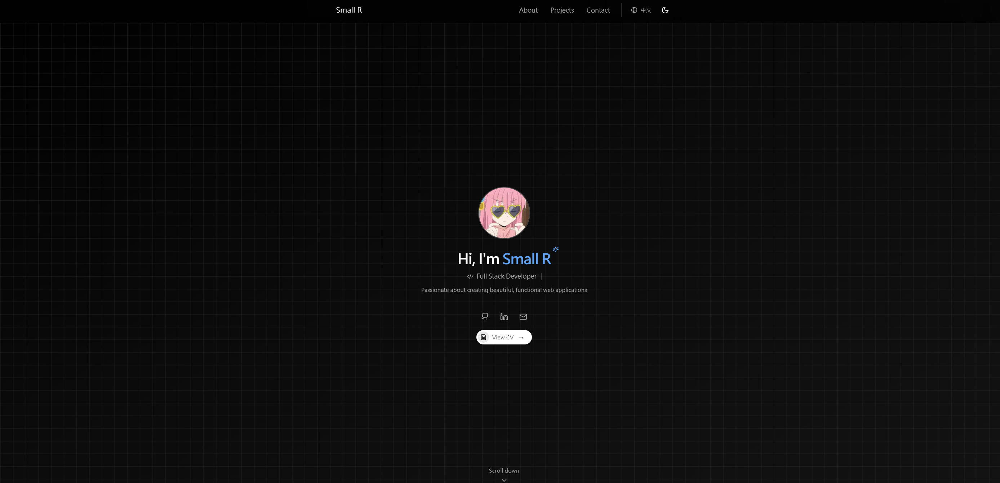

# Small R's Portfolio

A modern, internationalized portfolio website built with Next.js 14 and Tailwind CSS. [中文文档](./README.zh.md)



## 🌟 Features

### 🌍 Internationalization

- Built-in support for English and Chinese
- Easy to add new languages
- URL-based language switching
- Automatic language detection and redirection

### 🎨 Modern Design

- Responsive design for all devices
- Dark/Light theme with system preference detection
- Smooth animations and transitions
- Clean and minimal UI

### ⚡ Performance

- Next.js 14 App Router
- Static Site Generation (SSG)
- Optimized images and assets
- Fast page loads and navigation

## 🛠️ Customization

### Adding a New Language

1. Add language to types:

```typescript
// types/index.ts
export type Locale = "en" | "zh" | "your_locale";
```

2. Add translations:

```typescript
// constants/i18n.ts
export const translations = {
  your_locale: {
    nav: {
      about: "Your Translation",
      projects: "Your Translation",
      contact: "Your Translation",
    },
    // ... other translations
  },
};
```

3. Update site config:

```typescript
// config/site.ts
export const siteConfig = {
  locales: [
    { locale: "en", label: "English" },
    { locale: "zh", label: "中文" },
    { locale: "your_locale", label: "Your Language" },
  ],
};
```

### Customizing Content

#### Personal Information

```typescript
// config/site.ts
export const siteConfig: SiteConfig = {
  name: "Your Name",
  title: "Your Title",
  description: "Your Description",
  links: {
    github: "https://github.com/yourusername",
    linkedin: "https://linkedin.com/in/yourusername",
    email: "your.email@example.com",
  },
};
```

#### Projects

```typescript
// constants/projects.ts
export const projects: Project[] = [
  {
    title: "Project Name",
    description: "Project description",
    tags: ["Next.js", "TypeScript", "Tailwind"],
    image: "/projects/your-image.png",
    links: {
      demo: "https://your-demo.com",
      github: "https://github.com/your-repo",
    },
  },
  // Add more projects...
];
```

#### About Section

```typescript
// constants/i18n.ts
{
  about: {
    title: "Your Title",
    description: "Your Description",
    features: {
      // Add your features
    },
  },
}
```

### Adding Social Links

1. Add new link to site config:

```typescript
// config/site.ts
export const siteConfig: SiteConfig = {
  links: {
    twitter: "https://twitter.com/yourusername",
    // Add more social links
  },
};
```

2. Add icon to Hero component:

```typescript
// components/sections/Hero.tsx
const socialLinks = [
  {
    href: siteConfig.links.twitter,
    icon: Twitter,
    label: "Follow me on Twitter",
    target: "_blank",
  },
  // Add more social links
];
```

## 🚀 Getting Started

1. Clone and customize:

```bash
# Clone the repository
git clone https://github.com/Ynoob87/portfolio.git your-portfolio

# Navigate to the directory
cd your-portfolio

# Install dependencies
pnpm install

# Start development server
pnpm dev
```

2. Update configuration:

- Edit `config/site.ts` with your information
- Modify `constants/i18n.ts` for translations
- Update `constants/projects.ts` with your projects

3. Customize components:

- Modify components in `components/sections/`
- Update styles in `tailwind.config.js`
- Add new features as needed

## 📦 Project Structure

```
├── app/                  # Next.js 14 App Router
│   ├── [locale]/        # i18n routes
│   └── api/             # API routes
├── components/          # React components
│   ├── sections/        # Page sections
│   └── ui/             # UI components
├── config/             # Configuration files
├── constants/          # Constants and data
├── hooks/              # Custom React hooks
├── lib/               # Utility functions
├── public/            # Static assets
└── types/             # TypeScript types
```

## 🔧 Advanced Configuration

### Environment Variables

```env
NEXT_PUBLIC_SITE_URL=https://your-domain.com
NEXT_PUBLIC_GA_ID=your-ga-id
```

### Custom Themes

```typescript
// tailwind.config.js
module.exports = {
  theme: {
    extend: {
      colors: {
        primary: {
          // Add your colors
        },
      },
    },
  },
};
```

## 📝 Contributing

Contributions are welcome! Please read our [Contributing Guide](CONTRIBUTING.md) for details.

## 📄 License

This project is licensed under the MIT License - see the [LICENSE](LICENSE) file for details.

## 👤 Author

- Chen-Chi Wu
- Email: hhgg12661@gmail.com
- GitHub: [@Ynoob87](https://github.com/Ynoob87)
- LinkedIn: [alaner652](https://www.linkedin.com/in/alaner652/)

---

[中文文档](./README.zh.md) | [Report Bug](https://github.com/Ynoob87/portfolio/issues) | [Request Feature](https://github.com/Ynoob87/portfolio/issues)
